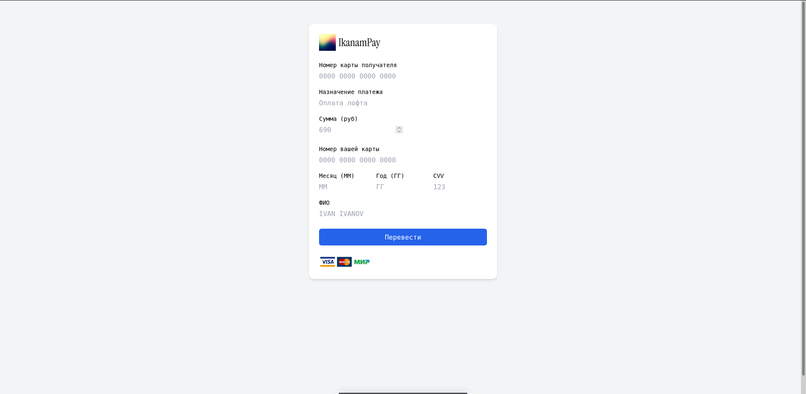
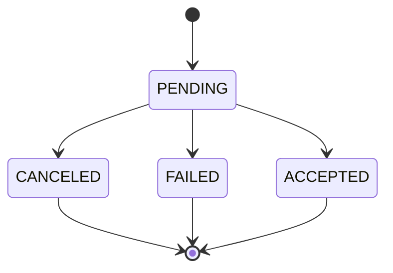

# Моковый платежный сервис IkanamPay

Было интересно разобраться в сущностях финтеха, сложностях конкурентной записи и проблеме Lost Update 


Реализовал сервис трансфера платежей в DDD. Транзакционность достиг с помощью паттерна `Unit of Work` 

Благодаря условию на возможные предыдущие состояния идейно решается Lost Update

```golang
// src/domain/interfaces.go

type PaymentRepoI interface {
  ...

	UpdateStatus(
		ctx context.Context,
		tx *sql.Tx,
		transactionID int,
		status TransferStatus,
		// Для консистентости данных добавляем ожидаемое состояние транзакции до обновления.
		// Позволит решить проблему Lost Update без акторной модели
		expectedStatus TransferStatus,
	) (*Payment, error)
}

```

Где внутри `UpdateStatus` исполняется SQL запрос (статусы на запись и проверку разные):

```sql
UPDATE 
  transfers 
SET 
  status = ? 
WHERE 
  id = ? AND status = ?
```

Поэтому строго описав машинку состояний платежа, получается что это условие выполняет роль глобального лока



